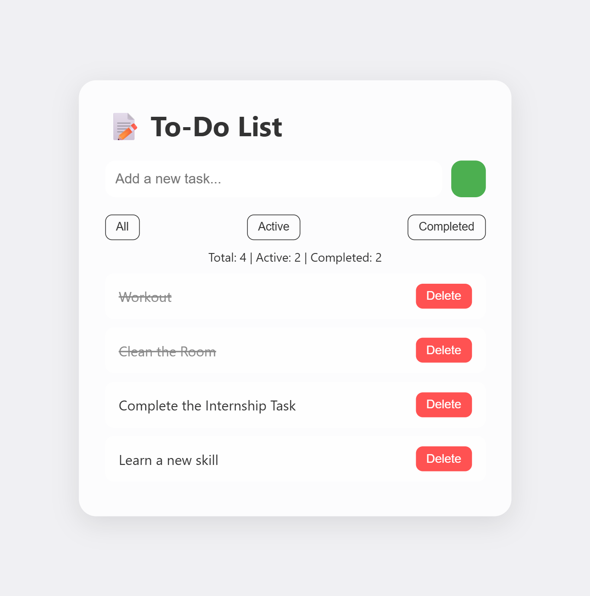

# 📝 To-Do List Web App (Internship Task 2)

A modern, responsive, and fully functional To-Do List Web Application built using **HTML**, **CSS**, and **Vanilla JavaScript** as part of a Web Development Internship task.

---

## 🚀 Features

- Add, complete, and delete tasks
- Real-time task counter (Total, Active, Completed)
- Filter tasks by All / Active / Completed
- Tasks persist using **localStorage**
- Responsive and modern UI with glassmorphism
- Dark mode toggle
- Smooth animations

---

## 🧠 Key Concepts Demonstrated

- **DOM Manipulation**
- **Event Listeners**
- **JavaScript ES6 (let, const, arrow functions)**
- **Dynamic UI Updates**
- **Array and Object Handling**
- **localStorage**
- **State Updates and Filtering**

---

## 📂 Folder Structure

```
todo-app/
├── index.html
├── style.css
├── script.js
└── README.md
```

## 📸 Screenshot



---

## 🚀 Live Demo

Check out the live version of the app [here](https://yourusername.github.io/To-Do-List-Web-App/).


## 💻 Setup Instructions

1. Clone this repository or download the ZIP.
2. Open the folder in **VS Code**.
3. Install the **Live Server** extension (if not already installed).
4. Right-click `index.html` and choose **"Open with Live Server"**.
5. Use the app: Add tasks, mark them complete, delete, and filter them!

---

